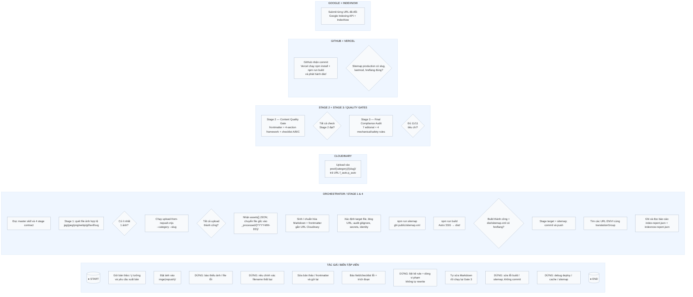
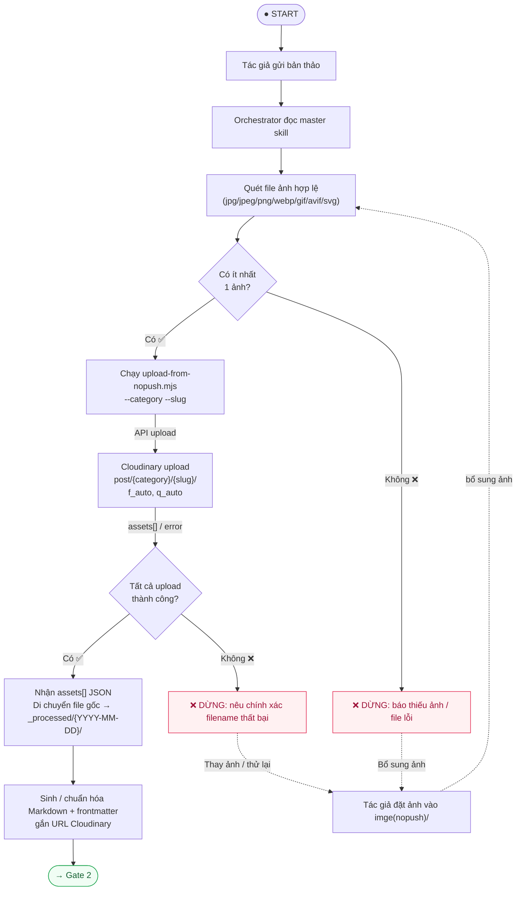
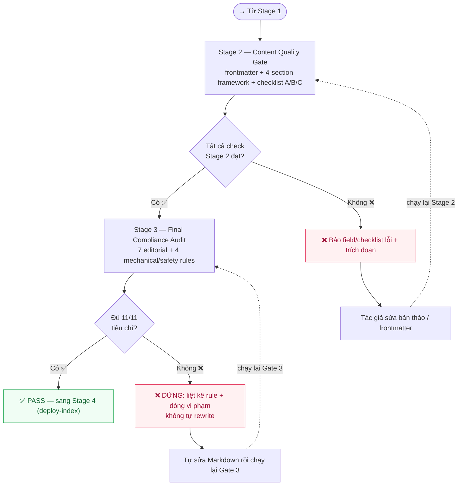
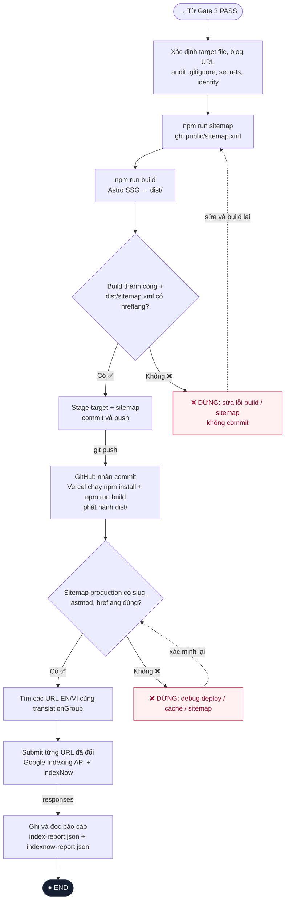

# SƠ ĐỒ HOẠT ĐỘNG — HỆ THỐNG XUẤT BẢN BLOG KIZETECH

> **Nguyên tắc:** Mọi giai đoạn là blocking gate — lỗi ảnh, nội dung, audit, build, deploy hoặc xác minh đều dừng pipeline.

## Tổng quan Swimlane

## Chi tiết luồng Stage 1 — Image Upload

## Chi tiết luồng Gate 2 & Gate 3

## Chi tiết luồng Stage 4 — Deploy & Index

## Lưu ý thứ tự bắt buộc ở Stage 4

1. **sitemap trước build** — `npm run sitemap` phải chạy TRƯỚC `npm run build`
2. **chỉ commit/push sau khi build pass** — verify `dist/sitemap.xml` có `xhtml:link` trước
3. **chỉ submit các URL cụ thể sau khi production sitemap đã đúng** — sitemap live trên Vercel phải đúng trước

## Bảng trạng thái Gate

| Gate | Điều kiện PASS | Action khi FAIL |
|------|----------------|-----------------|
| **Stage 1** (Image) | ≥1 ảnh hợp lệ, upload thành công | DỪNG — báo lỗi cụ thể |
| **Gate 2** (Content) | frontmatter OK + 4-section + checklist A/B/C | DỪNG — trích field lỗi, tác giả sửa |
| **Gate 3** (Final) | 11/11 tiêu chí Zero-Slop | DỪNG — liệt kê rule + dòng, không auto-rewrite |
| **Stage 4** (Build) | Build thành công + sitemap có hreflang | DỪNG — sửa và build lại |
| **Stage 4** (Deploy) | Sitemap production đúng | DỪNG — debug deploy/cache |
