# SƠ ĐỒ KIẾN TRÚC KIỂM DUYỆT — HAI CỔNG BẮT BUỘC (GATE 2 & GATE 3)

> **Input:** hợp đồng đầu vào (markdown + frontmatter + assets Cloudinary)
> **→ Gate 2 (content)** → **Gate 3 (audit 11 rule)**
> **→ Output:** triển khai hoặc dừng

## Luồng chính

```mermaid
flowchart LR
    subgraph INPUT["INPUT — Hợp đồng đầu vào"]
        ID_DRAFT["📄 Markdown draft<br/>+ frontmatter"]
        ID_FM["📋 frontmatter bắt buộc<br/>(JSON-LD contract)"]
        ID_ASSETS["🖼️ Cloudinary assets[]<br/>(f_auto, q_auto URL)"]
        ID_CONTENT["📝 Body markdown<br/>4-section framework"]
        ID_LOCALE["📁 Vị trí file<br/>/en/ hoặc /vi/"]
        ID_ORIGIN["📥 Nguồn<br/>Tác giả + Stage 1"]
    end

    subgraph GATE2["GATE 2 — Content Quality Gate"]
        G2_C1["✅ CHECK 2.1<br/>Frontmatter integrity (HARD FAIL)"]
        G2_C2["✅ CHECK 2.2<br/>Editorial framework (4-section)"]
        G2_C3["✅ CHECK 2.3<br/>Quality checklist A/B/C"]
        G2_DECISION{"Tất cả check<br/>Stage 2 đạt?"}
        G2_FAIL["❌ DỪNG pipeline<br/>Trích field/checklist fail + đoạn vi phạm"]
        G2_PASS["✅ PASS<br/>chuyển sang Gate 3"]
        G2_OUTPUT["📤 OUTPUT → Gate 3:<br/>Markdown hợp lệ + frontmatter đầy đủ<br/>+ 4-section + checklist A/B/C sạch"]
    end

    subgraph GATE3["GATE 3 — Final Compliance Audit"]
        G3_R1["R1 Anti-Preachy<br/>Cấm mệnh lệnh ngôi 2"]
        G3_R2["R2 Anti-Hallucination<br/>%/$/version phải verify"]
        G3_R3["R3 No Mock Stories<br/>Mở bằng Context + Failure"]
        G3_R4["R4 Slop-Word Ban<br/>Grep regex VI + EN"]
        G3_R5["R5 Burstiness<br/>Câu ngắn đan xen câu dài"]
        G3_R6["R6 Show-Don't-Tell<br/>≥2 code block thật"]
        G3_R7["R7 E-E-A-T<br/>H1→H2→H3 đúng cấp"]
        G3_R8["R8 Frontmatter JSON-LD<br/>Emit đầy đủ"]
        G3_R9["R9 No duplicate image<br/>![]() phải unique"]
        G3_R10["R10 No leaked secrets<br/>Env giả sk-proj-xxxx"]
        G3_R11["R11 No real-time location<br/>Bài viết kỹ thuật vĩnh cửu"]
        G3_DECISION{"11/11 rule<br/>đều pass?"}
        G3_FAIL["❌ DỪNG pipeline<br/>Liệt kê rule + dòng vi phạm<br/>Tác giả tự sửa, KHÔNG auto-rewrite"]
        G3_PASS["✅ PASS<br/>chuyển sang Stage 4 (deploy-index)"]
        G3_OUTPUT["📤 OUTPUT → Stage 4:<br/>Markdown đạt 7 luật biên tập<br/>+ 4 cơ khí, sẵn sàng deploy-index"]
    end

    ID_DRAFT --> G2_C1
    ID_FM --> G2_C1
    ID_ASSETS --> G2_C1
    ID_CONTENT --> G2_C2
    ID_LOCALE --> G2_C3

    G2_C1 --> G2_C2
    G2_C2 --> G2_C3
    G2_C3 --> G2_DECISION
    G2_DECISION -->|"Có ✅"| G2_PASS
    G2_DECISION -->|"Không ❌"| G2_FAIL
    G2_FAIL -.->|"sửa và quay lại Gate 2"| ID_DRAFT
    G2_PASS --> G2_OUTPUT

    G2_OUTPUT --> G3_R1
    G2_OUTPUT --> G3_R2
    G2_OUTPUT --> G3_R3
    G3_R1 --> G3_R4
    G3_R2 --> G3_R5
    G3_R3 --> G3_R6
    G3_R4 --> G3_R7
    G3_R5 --> G3_R8
    G3_R6 --> G3_R9
    G3_R7 --> G3_R10
    G3_R8 --> G3_R11
    G3_R9 --> G3_DECISION
    G3_R10 --> G3_DECISION
    G3_R11 --> G3_DECISION
    G3_DECISION -->|"Có ✅"| G3_PASS
    G3_DECISION -->|"Không ❌"| G3_FAIL
    G3_FAIL -.->|"sửa Markdown, chạy lại Gate 3"| ID_DRAFT
    G3_PASS --> G3_OUTPUT

    style G2_FAIL fill:#FFF1F2,stroke:#E11D48,color:#9F1239
    style G3_FAIL fill:#FFF1F2,stroke:#E11D48,color:#9F1239
    style G2_PASS fill:#F0FDF4,stroke:#16A34A,color:#166534
    style G3_PASS fill:#F0FDF4,stroke:#16A34A,color:#166534
    style G3_OUTPUT fill:#F0FDF4,stroke:#16A34A,color:#166534
```



## Chi tiết Gate 2 — Content Quality Gate

### CHECK 2.1 — Frontmatter integrity (HARD FAIL)

Mọi field bắt buộc phải tồn tại, đúng kiểu và đúng whitelist:

| Field | Quy tắc |
|-------|---------|
| `title` | ≤ 70 chars, sentence-case |
| `excerpt` | 110–160 chars, no fluff |
| `image` | Cloudinary URL (từ Stage 1) |
| `date` | ISO `YYYY-MM-DD` (dùng làm lastmod) |
| `category` | ∈ `{culture, technology, entertainment}` |
| `language` | ∈ `{en, vi}` |
| `translationGroup` | đồng nhất EN↔VI |
| `tags` | 3–5 tag concrete, không generic |
| `author` | = `'Lê Văn Trí'` (single-author) |

> **Category nghỉ ⇒ REFUSE** (không sửa được): travel · food · lifestyle · business · health · education · sports · world

### CHECK 2.2 — Editorial framework (4-section)

```
### 1 Hook
   (mở bằng Project Context + Failure Symptoms, KHÔNG mock story)

### 2 Friction
   (nêu điểm đau mà thị trường bỏ qua hoặc giải sai)

### 3 Proof & Sandbox
   (lab env + ≥1 code block + ảnh minh chứng)

### 4 Actionable Synthesis
   (PAIN → RELIEF, CTA: build & break)
```

### CHECK 2.3 — Quality checklist A/B/C

**A. Anti-fluff:**
- ≥1 real code block / CLI
- lab env có tham số vật lý
- ≥2 hyperlink official docs

**B. Anti-AI voice:**
- rhythm động (câu <6 từ đan xen câu dài)
- KHÔNG slop-word
- có friction thật (ức chế / nhẹ nhõm / bất ngờ)

**C. i18n + SEO:**
- chỉ `/en/` hoặc `/vi/`
- thuật ngữ kỹ thuật giữ tiếng Anh trong bản VI
- semantic HTML h2/h3/blockquote/ol/ul

## Chi tiết Gate 3 — Final Compliance Audit (11 rules)

### 7 luật biên tập

| Rule | Mô tả | Phương pháp kiểm tra |
|------|--------|----------------------|
| **R1 Anti-Preachy** | Cấm động viên/giáo điều; quét câu mệnh lệnh ngôi 2 | Grep `you must`, `bạn phải`, `hãy nhớ rằng` |
| **R2 Anti-Hallucination** | Mọi % / $ / version / tên sản phẩm phải có URL verify | Phép đo cá nhân hoặc gắn cờ `approx` |
| **R3 No Mock Stories** | KHÔNG mở bằng `phòng trọ lạnh`, `cà phê nguội` | Grep mock story pattern |
| **R4 Slop-Word Ban** | Cấm delve, crucial, vật bất ly thân… | Grep regex VI + EN exact match |
| **R5 Burstiness & Perplexity** | 3+ câu liên tiếp cùng độ dài = fail | Đếm nhịp câu |
| **R6 Show-Don't-Tell** | ≥2 code block thật + edge case | Verify code block có tham số vật lý |
| **R7 E-E-A-T** | H1→H2→H3 đúng cấp, link về pillar | Check heading hierarchy |

### 4 luật cơ khí

| Rule | Mô tả | Phương pháp kiểm tra |
|------|--------|----------------------|
| **R8 Frontmatter JSON-LD** | Mọi field emit vào Article + BlogPosting JSON-LD | Verify all fields present |
| **R9 No duplicate image URL** | `` trong body phải unique | So sánh URL, bỏ bản sao |
| **R10 No leaked secrets** | Code dùng env giả `sk-proj-xxxx…` | Grep credentials pattern |
| **R11 No real-time location** | Không `đang ở quán X lúc 2h` | Grep timestamp + location |

> **11/11 tiêu chí = đủ điều kiện sang Stage 4 (deploy-index). Bất kỳ tiêu chí nào fail = STOP tuyệt đối.**

## Hợp đồng back-flow khi fail

Khi bất kỳ gate nào fail:

1. **STOP pipeline ngay lập tức** — không publish, không push, không tự rewrite
2. **Trích dẫn chính xác** dòng / đoạn / field vi phạm
3. **Đánh số rule** (vd: `R4 + R6 fail`)
4. Tác giả sửa bản thảo rồi chạy lại Gate 3 (hoặc Gate 2 nếu check mới)
5. Bản thảo gốc **giữ nguyên trong chat** cho đến khi Stage 4 thành công (rollback dễ)
6. **KHÔNG commit / push** nếu chưa pass cả 3 gate (kể cả Gate 4 deploy-index)

## Legend

| Màu | Ý nghĩa |
|-----|---------|
| 🔵 Xanh dương | Input zone |
| 🟠 Cam | Gate 2 — content-check |
| 🔴 Đỏ | Gate 3 — final-check (11 rule) |
| 🟢 Xanh lá | PASS → stage tiếp theo |
| 🔴 Hồng | FAIL → STOP → tác giả sửa |
