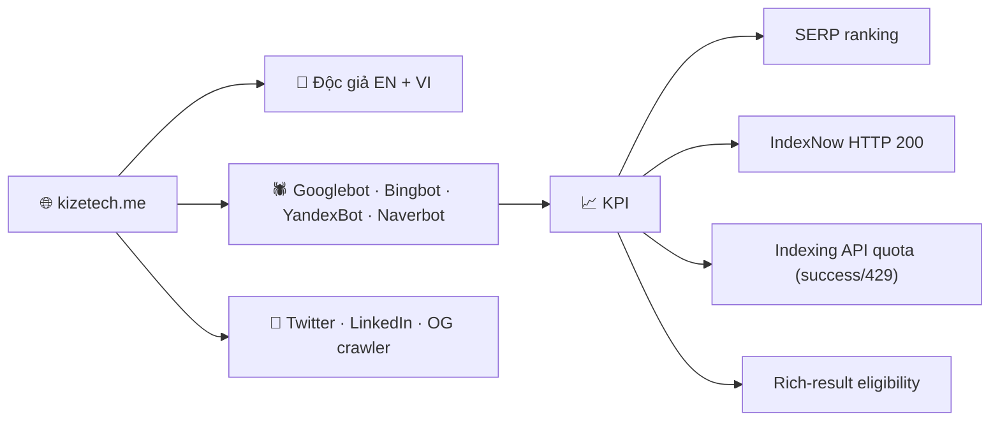

# KIẾN TRÚC HỆ THỐNG & TECH STACK — kizetech.me

> **Tổng quan:** Authoring (Windows + Cursor) → 4-stage pipeline → Vercel runtime/CDN → External services → Consumers; kèm lớp JSON-LD schema song song với build.

## Sơ đồ kiến trúc tổng thể

```mermaid
flowchart LR
    subgraph AUTHOR["1. MÔI TRƯỜNG TÁC GIẢ (Windows 11 + PowerShell + Cursor)"]
        A_CURSOR["🖥️ Cursor IDE<br/>(AI editor)"]
        A_SKILLS["📋 Skills bắt buộc<br/>/.cursor/skills/"]
        A_IMGFOLDER["📁 imge(nopush)/<br/>ảnh thô chưa upload"]
        A_SECRETS["🔐 google console/<br/>(GITIGNORED)"]
        A_CONTENT["📄 src/content/blog/{en,vi}/{slug}.md"]
        A_I18N["🌐 src/i18n/locales/{en,vi}.ts"]
        A_LAYOUTS["🎨 src/layouts/<br/>BaseLayout · BlogPostLayout · GoneLayout"]
    end

    subgraph PIPELINE["2. PIPELINE XUẤT BẢN (Node.js 20+ · Astro 5 · TypeScript)"]
        P_STAGE1["🖼️ Stage 1<br/>image-upload<br/>upload-from-nopush.mjs"]
        P_STAGE2["📝 Stage 2<br/>content-check<br/>skill-2-content-check.md"]
        P_STAGE3["🔍 Stage 3<br/>final-check<br/>skill-3-final-check.md"]
        P_STAGE4["🚀 Stage 4<br/>deploy-index<br/>deploy-index/SKILL.md"]
        P_SITEMAP["🗺️ npm run sitemap<br/>generate-sitemap.mjs"]
        P_BUILD["🏗️ npm run build<br/>Astro 5 SSG → dist/"]
        P_GIT["📤 git add + commit + push"]
        P_GOOGLE["📣 Google Indexing API<br/>submit-index.mjs"]
        P_INDEXNOW["📣 IndexNow<br/>submit-indexnow.mjs"]
        P_REPORT["📊 Báo cáo<br/>(GITIGNORED)"]
    end

    subgraph RUNTIME["3. STATIC SITE & VERCEL RUNTIME (CDN)"]
        R_ASTRO["⚡ Astro 5<br/>(static + SSG)"]
        R_DIST["📂 dist/<br/>HTML + sitemap.xml + _astro/"]
        R_VERCEL["☁️ Vercel<br/>(hosting + CDN)"]
        R_DOMAIN["🌐 kizetech.me<br/>/{lang}/blog/{slug}/"]
        R_GONE["❌ HTTP 410 GoneLayout<br/>5s countdown EN/VI"]
        R_OG["🔗 canonical + hreflang + OG"]
    end

    subgraph EXTERNAL["4. DỊCH VỤ BÊN NGOÀI"]
        E_CLOUDINARY["☁️ Cloudinary CDN<br/>res.cloudinary.com"]
        E_GOOGLE_API["📡 Google Indexing API<br/>indexing.googleapis.com"]
        E_INDEXNOW["📡 IndexNow<br/>api.indexnow.org → Bing + Yandex + Naver"]
        E_GITHUB["🔧 GitHub webhook<br/>trigger Vercel build"]
    end

    subgraph SCHEMA["5. LỚP SEO / JSON-LD"]
        S_BASE["🌐 BaseLayout.astro<br/>global @graph"]
        S_BLOGPOST["📄 BlogPostLayout.astro<br/>Article + BlogPosting + BreadcrumbList"]
        S_AUTHOR["👤 [lang]/author.astro<br/>ProfilePage + Person"]
        S_GONE["❌ GoneLayout.astro<br/>HTTP 410 + 5s"]
        S_SITEMAP["🗺️ scripts/generate-sitemap.mjs<br/>public/sitemap.xml → dist/sitemap.xml"]
    end

    subgraph CONSUMER["6. NGƯỜI DÙNG CUỐI"]
        C_READER["👤 Độc giả EN + VI"]
        C_CRAWLER["🕷️ Search crawler<br/>Googlebot · Bingbot · YandexBot"]
        C_SITEMAP["📊 Google Search Console<br/>Bing Webmaster"]
        C_SOCIAL["📱 Social share<br/>Twitter · LinkedIn · OG"]
        C_KPI["📈 KPI: SERP, IndexNow 200,<br/>Indexing API quota"]
    end

    %% Authoring → Pipeline
    A_CURSOR -->|"đọc skill + chạy"| A_SKILLS
    A_IMGFOLDER -->|"ảnh thô"| P_STAGE1
    A_CONTENT -->|"bản thảo EN/VI"| P_STAGE2
    A_SECRETS -.->|"creds (không commit)"| P_STAGE1

    %% Pipeline flow
    P_STAGE1 -->|"assets[] JSON + URL"| P_STAGE2
    P_STAGE2 -->|"markdown đạt framework"| P_STAGE3
    P_STAGE3 -->|"markdown sạch 11 rule"| P_STAGE4
    P_STAGE4 -->|"đọc frontmatter"| P_SITEMAP
    P_SITEMAP -->|"public/sitemap.xml"| P_BUILD
    P_BUILD -->|"dist/ ready"| P_GIT
    P_BUILD -->|"copy"| R_DIST
    P_GIT -->|"git push"| E_GITHUB
    P_GIT -->|"Google notify"| P_GOOGLE
    P_GOOGLE -->|"URL_UPDATED"| E_GOOGLE_API
    P_STAGE4 -->|"submit batch"| P_INDEXNOW
    P_INDEXNOW -->|"10k URL/req"| E_INDEXNOW
    P_SITEMAP -->|"báo cáo"| P_REPORT

    %% Runtime
    R_DIST --> R_ASTRO
    R_ASTRO -->|"deploy"| R_VERCEL
    R_VERCEL -->|"CDN edge"| R_DOMAIN
    E_GITHUB -->|"webhook → build"| R_VERCEL
    E_CLOUDINARY -.->|"ảnh CDN"| R_DOMAIN
    R_DOMAIN -->|"GET HTML"| C_READER
    R_DOMAIN -->|"GET + crawl"| C_CRAWLER
    R_DOMAIN -->|"OG + Twitter Card"| C_SOCIAL
    R_GONE -->|"URL retired"| C_READER

    %% Schema (dashed)
    R_ASTRO -.->|"emit JSON-LD"| S_BLOGPOST
    P_SITEMAP -.->|"<lastmod> + hreflang"| S_SITEMAP
    R_DOMAIN -.->|"serve HTML chứa JSON-LD"| S_BASE
    E_GOOGLE_API -.->|"success / 429"| C_KPI
    E_INDEXNOW -.->|"HTTP 200"| C_KPI
    C_CRAWLER -.->|"rich-result eligibility"| C_KPI

    style E_SECRETS fill:#FEE2E2,stroke:#E11D48,color:#9F1239
```



## Chi tiết 4 Stage Pipeline

### Stage 1 — Image Upload

```
scripts/upload-from-nopush.mjs --category --slug
```

**Quy trình:**
1. Đọc `google console/cloudinary.txt`
2. Sử dụng Cloudinary SDK
3. Upload từng ảnh vào `post/{category}/{slug}/` với `f_auto,q_auto`
4. Trả `assets[]` JSON
5. Di chuyển file gốc → `imge(nopush)/_processed/{YYYY-MM-DD}/`

**Định dạng ảnh hợp lệ:** `.jpg` · `.jpeg` · `.png` · `.webp` · `.gif` · `.avif` · `.svg`

### Stage 2 — Content Check

**File:** `skill-2-content-check.md`

**Kiểm tra:**
- **CHECK 2.1** — Frontmatter validator (8 field bắt buộc)
- **CHECK 2.2** — 4-section framework (Hook / Friction / Proof / Action)
- **CHECK 2.3** — Checklist A/B/C (anti-fluff, anti-AI, i18n/SEO)

> Refuse retired category.

### Stage 3 — Final Check

**File:** `skill-3-final-check.md`

**7 luật biên tập:**
1. **Anti-Preachy** — Cấm mệnh lệnh ngôi 2
2. **Anti-Hallucination** — %/$/version phải verify
3. **No Mock Stories** — Mở bằng Context + Failure
4. **Slop-Word Ban** — Grep regex VI + EN
5. **Burstiness** — Câu ngắn đan xen câu dài
6. **Show-Don't-Tell** — ≥2 code block thật + edge case
7. **E-E-A-T** — H1→H2→H3 đúng cấp

**4 luật cơ khí:**
8. Frontmatter JSON-LD (emit đầy đủ)
9. No duplicate image URL
10. No leaked secrets (env giả `sk-proj-xxxx`)
11. No real-time location

> Grep regex, không 'vibe check'.

### Stage 4 — Deploy & Index

**Thứ tự bắt buộc:**

```
1. Xác định target + blogUrl
2. Audit .gitignore + secrets + identity
3. npm run sitemap                ← TRƯỚC build
4. npm run build
5. Verify dist/sitemap.xml có xhtml:link
6. git add + commit + push
7. Verify sitemap live (post-deploy)
8. Submit từng URL cùng translationGroup
```

**Scripts:**

| Script | Chức năng |
|--------|-----------|
| `generate-sitemap.mjs` | Tạo sitemap với `<lastmod>` + hreflang pair |
| `submit-index.mjs` | Google Indexing API (OAuth + quota/day) |
| `submit-indexnow.mjs` | IndexNow → Bing + Yandex + Naver + Seznam + Yep (10k URL/req) |

## Kiến trúc JSON-LD Schema

```mermaid
flowchart TB
    S1["BaseLayout.astro<br/>global @graph"]
    S1a["WebSite.name + @id + description"]
    S1b["Person.name + jobTitle + sameAs<br/>(github/linkedin/orcid)"]
    S1c["Organization.founder → Person"]

    S2["BlogPostLayout.astro<br/>Article + BlogPosting + BreadcrumbList"]
    S2a["headline ← title"]
    S2b["description ← excerpt"]
    S2c["image[] ← image (Cloudinary URL)"]
    S2d["datePublished/dateModified ← date"]
    S2e["author.url ← /<lang>/author"]
    S2f["inLanguage ← language"]
    S2g["keywords ← tags.join(', ')"]
    S2h["articleSection ← category"]

    S3["[lang]/author.astro<br/>ProfilePage + Person"]
    S3a["ProfilePage.mainEntity = Person"]
    S3b["name (locale-aware)"]
    S3c["jobTitle = 'AI Engineer'"]
    S3d["sameAs = github + linkedin + orcid"]
    S3e["worksFor → Organization @id"]

    S4["GoneLayout.astro<br/>HTTP 410 + 5s countdown"]
    S4a["Trigger khi: slug invalid / bài đã xoá / markdown hỏng / translationGroup mismatch / category retired"]

    S1 --> S2
    S1 --> S3
    S1 --> S4
```



## Tech Stack tổng hợp

| Layer | Technology |
|-------|-----------|
| **Framework** | Astro 5 (SSG, content collection) |
| **Language** | TypeScript + .astro components |
| **Hosting** | Vercel (auto-build từ git push) |
| **Image CDN** | Cloudinary (f_auto, q_auto) |
| **Index nhanh** | Google Indexing API (per-URL) + IndexNow |
| **Sitemap** | `scripts/generate-sitemap.mjs` (custom XML) |
| **i18n** | `src/i18n/locales/{en,vi}.ts` + `[lang]/` routes |
| **JSON-LD** | BaseLayout + BlogPostLayout + author page |
| **410 fallback** | GoneLayout (5s countdown, EN/VI) |
| **Repo** | github.com/levantri10/kizetech_blog |

## Cấu trúc thư mục quan trọng

```
/
├── .cursor/skills/
│   ├── write-blog-post/SKILL.md         (master orchestrator)
│   ├── skills-list/skill-1-image-upload.md
│   ├── skills-list/skill-2-content-check.md
│   ├── skills-list/skill-3-final-check.md
│   └── deploy-index/SKILL.md
├── scripts/
│   ├── upload-from-nopush.mjs           Stage 1 (Cloudinary)
│   ├── generate-sitemap.mjs             Stage 4 (sitemap.xml)
│   ├── submit-index.mjs                 Stage 4 (Google Indexing API)
│   ├── submit-indexnow.mjs              Stage 4 (IndexNow)
│   └── scan-gsc-urls.mjs               GSC audit
├── src/
│   ├── content/blog/{en,vi}/{slug}.md
│   ├── i18n/locales/{en,vi}.ts
│   ├── layouts/
│   │   ├── BaseLayout.astro            (global @graph)
│   │   ├── BlogPostLayout.astro        (Article + BlogPosting)
│   │   └── GoneLayout.astro            (HTTP 410)
│   └── config/site.ts
├── public/
│   └── sitemap.xml                      ← Vercel serve file này
├── google console/                      (GITIGNORED)
│   ├── cloudinary.txt
│   ├── bing-api-key.txt
│   └── kizetech-indexing*.json
└── vercel.json                          routing tĩnh /[lang]/ & /gone/
```

## Consumer & KPI


