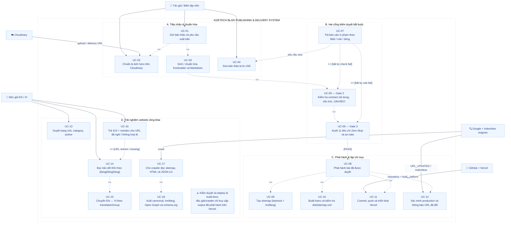

# SƠ ĐỒ USE CASE — HỆ THỐNG XUẤT BẢN BLOG KIZETECH

> **Phạm vi:** tiếp nhận bài viết → kiểm duyệt bắt buộc → build/deploy → phục vụ EN/VI → thông báo công cụ tìm kiếm

## Ký hiệu

| Ký hiệu | Ý nghĩa |
|----------|----------|
| Đường liền | Actor tham gia use case |
| Nét đứt | Include / Extend relationship |
| Vùng màu | Nhóm chức năng, không phải thứ tự thực thi |

## 18 Use Cases

### A. Tiếp nhận & chuẩn hóa
- **UC-01:** Gửi bản thảo và yêu cầu xuất bản *(bao gồm UC-02, UC-03)*
- **UC-02:** Chuẩn bị ảnh hero trên Cloudinary
- **UC-03:** Sinh / chuẩn hóa frontmatter và Markdown *(dẫn đến Gate 2)*
- **UC-04:** Sửa bản thảo bị từ chối

### B. Hai cổng kiểm duyệt bắt buộc
- **UC-05 (Gate 2):** Kiểm tra contract nội dung, cấu trúc, i18n/SEO
- **UC-06 (Gate 3):** Audit 11 tiêu chí Zero-Slop và an toàn
- **UC-07:** Trả báo cáo vi phạm theo field / rule / dòng *(extend từ Gate 2 & 3)*

### C. Phát hành & lập chỉ mục
- **UC-08:** Phát hành bài đã được duyệt *(bao gồm UC-09 → UC-12)*
- **UC-09:** Tạo sitemap (lastmod + hreflang)
- **UC-10:** Build Astro và kiểm tra dist/sitemap.xml
- **UC-11:** Commit, push và triển khai Vercel
- **UC-12:** Xác minh production và thông báo URL đã đổi

### D. Trải nghiệm website công khai
- **UC-13:** Duyệt trang chủ, category, author
- **UC-14:** Đọc bài viết tĩnh theo /{lang}/blog/{slug} *(có thể extend UC-16)*
- **UC-15:** Chuyển EN ↔ VI theo translationGroup
- **UC-16:** Trả 410 + noindex cho URL đã nghỉ / không hợp lệ
- **UC-17:** Cho crawler đọc sitemap, HTML và JSON-LD
- **UC-18:** Xuất canonical, hreflang, Open Graph và schema.org
